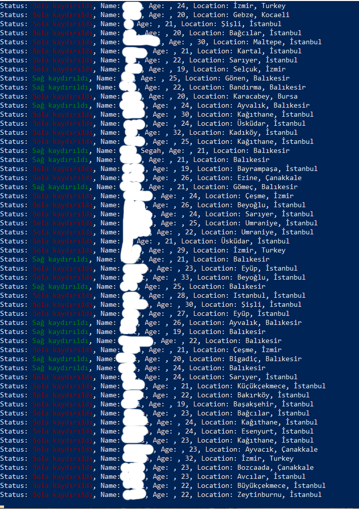

# Rasputin - Next Generation Bumble Auto-Swipe Bot


This Python project automates interactions with the Bumble dating app, specifically designed to filter profiles based on location and perform swipe actions. The bot leverages the Selenium library for web automation and uses keyboard shortcuts for pausing, resuming, and terminating the bot.

## Features

- **Automatic Profile Filtering**: Automatically filters and interacts with profiles based on the specified location.
- **Customizable Location Targeting**: Input your target location to focus swipes on profiles from a specific area.
- **Keyboard Controls**:
  - `Space`: Pause and resume the bot.
  - `Esc`: Terminate the bot and close the browser.
- **Real-Time Console Feedback**: Get real-time updates in the console about the bot's actions.

## Prerequisites

Before you begin, ensure you have met the following requirements:

- Python 3.x installed on your machine.
- Google Chrome browser installed.
- ChromeDriver matching your Chrome version (you can download it [here](https://sites.google.com/chromium.org/driver/)).
- Required Python packages: `selenium`, `keyboard`, `colorama`.

## Installation

1. **Clone the repository**:
    ```bash
    git clone https://github.com/yourusername/bumble-auto-swipe-bot.git
    cd bumble-auto-swipe-bot
    ```

2. **Install the dependencies**:
    ```bash
    pip install -r requirements.txt
    ```

3. **Set up ChromeDriver**:
    - Download ChromeDriver matching your Chrome version.
    - Place the `chromedriver.exe` file in a directory included in your system's PATH, or specify its path in the script.

4. **Configure Chrome User Data**:
    - Replace `C:\\path\\to\\your\\chrome\\profile` in the script with the path to your Chrome user profile. This allows the bot to use an existing logged-in session. I recommend you that do not change the default location

## Usage

1. **Run the bot**:
    ```bash
    python bumble_auto_swipe.py
    ```

2. **Log into Bumble**:
    - The bot will launch a Chrome browser window. Log into your Bumble account manually.

3. **Start the automation**:
    - After logging in, the bot will ask for confirmation. If you are logged in, press `Y` to start the automation.

4. **Input the target location**:
    - When prompted, enter the location (e.g., Bursa) you want the bot to focus on.

5. **Control the bot**:
    - Use `Space` to pause/resume the bot and `Esc` to terminate it.

## Example Output

While the bot is running, you'll see output like this in your console:

## Demonstration Video

[](https://www.youtube.com/watch?v=Aue75rB8ukc)


```bash
Status: Sağ kaydırıldı, Name: John, Age: 28, Location: Bursa
Status: Sola kaydırıldı, Name: Jane, Age: 24, Location: Istanbul
```

Here's what the bot's output might look like in your console:



## Requirements

- The required Python packages are listed in the `requirements.txt` file. To install them, use the following command:

```bash
pip install -r requirements.txt
```

Contents of requirements.txt:

```bash
selenium==4.10.0
keyboard==0.13.5
colorama==0.4.6
```

## Troubleshooting

- **Element Not Found**: If the bot fails to find certain elements, it might be due to changes in Bumble's website structure. Consider inspecting the page to update the XPaths in the script.
- **Browser Not Opening**: Ensure that ChromeDriver is correctly installed and matches your version of Chrome.

## Contributing

- If you'd like to contribute to this project, please fork the repository and use a feature branch. Pull requests are warmly welcome.

## License

- This project is licensed under the MIT License. See the `LICENSE` file for details.

## Disclaimer

- This project is for educational purposes only. Use it responsibly and at your own risk. The developer is not responsible for any misuse or consequences that may arise from using this script. I will not be responsible for data that you collected. Furthermore, do not use my tool for your abusement purposes. The script does not stores real time data it just process it for name, age, location and prompts the screen. DO NOT USE DATA FOR BAD PURPOSES.


